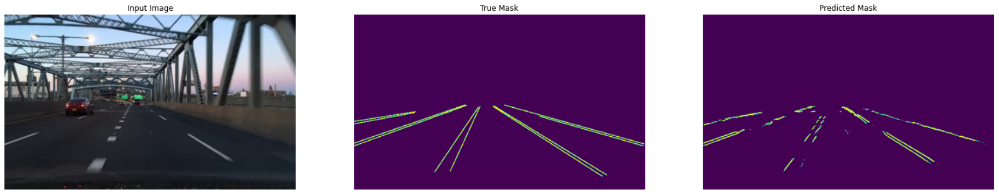

# ClosedAI - Lane Line Detection

This repository implements lane line detection on the [BDD100k](https://www.vis.xyz/bdd100k/) dataset. To address this task our team designed a deep convolutional neural network with a Resnet-50V2 backbone to perform semantic segmentation of lane lines. Our model outputs two channels with it's prediction if a pixel is a lane line or not. An example of the our models output can be seen below:

The python virtual environment used to train and test our model's can bee seen at `10k_run/create_env.sh`. Our model was trained using gpu's with the sbatch script located at `10k_run/submit_spu.sh` and ran with the command '`sbatch submit_gpu.sh`' in the '10k_run' directory. A summary of our model architecture can be seen below:

Contributors:
- David Perez
- Josh Bellmyer
- Kort Hamel
- Samuel Thompson